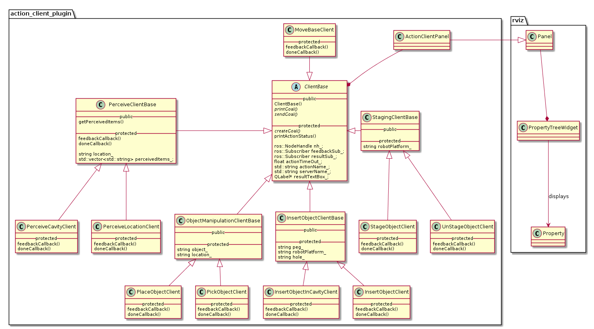

## Action Client Panel
The Action Client panel eases the task of send goals to an action server. The panel provides a GUI for selecting actions, setting their parameters, sending action goals and monitoring progress of action execution. It has the following features:

- Drop-down list of all supported actions and their parameters.
- Support for loading known parameter values from multiple sources.
- Suport for typing in the parameter values providing suggestions of known parameter values.
- Display of action execution status.
- Support for four types of parameters: boolean, integer, float and enumerations.

Authors:
1. Sushant Vijay Chavan
2. Ahmed Faisal Abdelrahman


### Instructions
#### Using the Action Client Panel:
The panel can be used by following these steps:

- Start Rviz and add the ActionClientPanel from the "Panels" tab. ```Panels -> Add New Panel -> ActionClientPanel```
- Select a desired action form the drop-down list in the newly added ActionClientPanel.
- Set the required parameters for executing the action.
- Click on the ```Send Goal``` button.
- The status of action execution will be then displayed below the ```Send Goal``` button.
##### Adding new action clients
The Action Client Panel can be easily extended to support new actions clients. All the supported actions clients and their parameters are described in the ```ActionClients.yaml``` file. Follow the below steps to add new action clients:

- Extend the ```ActionClients.yaml``` file. For example, to add a ```place_object``` action along with its parameters add the below lines:
```
    place_object:
      object: string
      location: enum
```
- Implement a new class for the action client that derives from the ```ClientBase``` class. Check the ```MoveBaseClient``` class for an example.
- Add a new callback method to create an object of the class implemented in the previous step. Check the ```executeMoveBaseAction``` method of ```ActionClientPanel``` class for an example.
- Extend the ```handleButton``` method in ```ActionClientPanel``` class to register this new callback function. For example, add the below lines to the existing ```if-else``` block
```
    else if (actionName == "pick_object")
      executePickObjectAction();
```
##### Setting up enumerations (drop-down lists)
Enumerations are used in order to provide drop-down lists in the ActionClientPanel. We support two type of enum initializations:

- Enum values declared explicitly in the ```ActionClients.yaml``` file.
    - Example
```
      robot_platform:
        - platform_right
        - platform_left
        - platform_middle
```
- Enum values lazily loaded from another source on demand.
    - For example the navigation goals specified in the active ```navigation_goals.yaml``` file.
    - In order to declare such a lazily loaded enum parameter in the ```ActionClients.yaml``` file, declare its type as ```enum``` indicating that it will be loaded later. For example ```location: enum```

The method ```getEnumStrings``` in the ```ActionClientPanel``` class handles the loading of enum values from the correct location. Do not forget to update this method whenever a new enum parameter is added or an existing enum parameter is changed in the ```ActionClients.yaml``` file.


### Architecture
